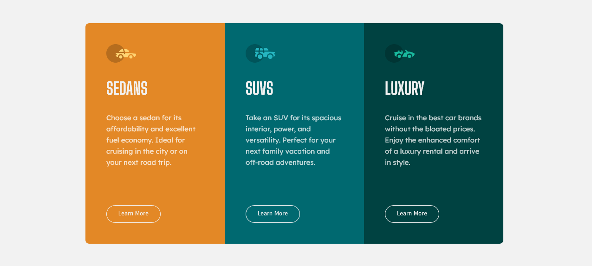

# Frontend Mentor - Clipboard landing page solution

This is a solution to the [3-column preview card component  challenge on Frontend Mentor](https://www.frontendmentor.io/challenges/3column-preview-card-component-pH92eAR2-). Frontend Mentor challenges help you improve your coding skills by building realistic projects. 

## Table of contents

- [Overview](#overview)
  - [The challenge](#the-challenge)
  - [Screenshot](#screenshot)
  - [Links](#links)
- [My process](#my-process)
  - [Built with](#built-with)
  - [Useful resources](#useful-resources)
- [Author](#author)


## Overview

### The challenge

Users should be able to:

- View the optimal layout for the site depending on their device's screen size
- See hover states for all interactive elements on the page

### Screenshot




### Links

- Solution URL: [Github Repo](https://github.com/abdelrhman492/3-column-preview-card-component)
- Live Site URL: [Click Me 😊](https://abdelrhman492.github.io/3-column-preview-card-component)

### Built with

- Semantic HTML5 markup
- SASS Preprocessor
- Flexbox
- Desktop-first workflow

To see how you can add code snippets, see below:

```HTML
<div class="col">
  <div class="icon">
    
  </div>
  <div class="title">SUVs</div>
  <div class="description">
    Take an SUV for its spacious interior, power, and versatility. Perfect
    for your next family vacation and off-road adventures.
  </div>
  <button>Learn More</button>
</div>
```
```css
body .container .col {
  width: 300px;
  padding: 45px;
}
body .container .col:nth-child(1) {
  background: var(--Bright-orange);
}
body .container .col:nth-child(2) {
  background: var(--Dark-cyan);
}
body .container .col:nth-child(3) {
  background: var(--Very-dark-cyan);
}
```

### Useful resources

- [Mozilla Developer Network](https://developer.mozilla.org/en-US/docs/Web/CSS) - This helped me for css properties. I really liked this pattern and will use it going forward.
- [StackOverFlow](https://www.stackoverflow.com) - This is an amazing website which helped me solve my problems

## Author

- Frontend Mentor - [@AbdElRhman492](https://www.frontendmentor.io/profile/AbdElRhman492)
